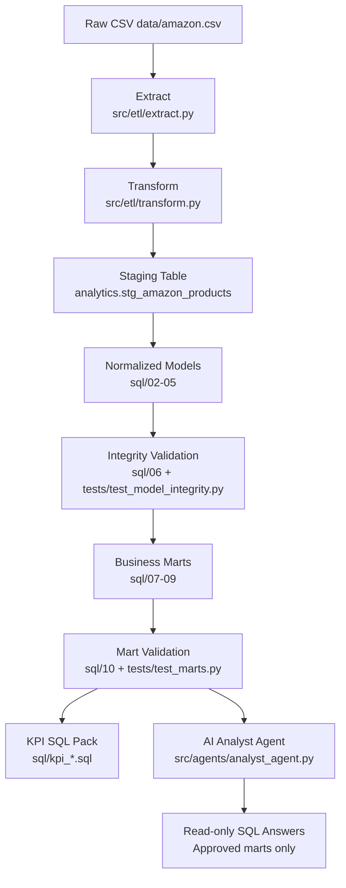

# Architecture Diagram

## Layer Summary
- `Raw`: immutable source file.
- `Staging`: typed, cleaned canonical row set.
- `Normalized`: star-like model for stable joins and integrity.
- `Marts`: business-facing aggregates for dashboards and reporting.
- `AI Agent`: controlled natural-language interface to marts.

## Reliability Controls
- Pipeline quality gate at transform stage.
- PK/FK integrity checks after normalized model build.
- Mart health checks after mart build.
- Automated tests for CI-ready validation.
